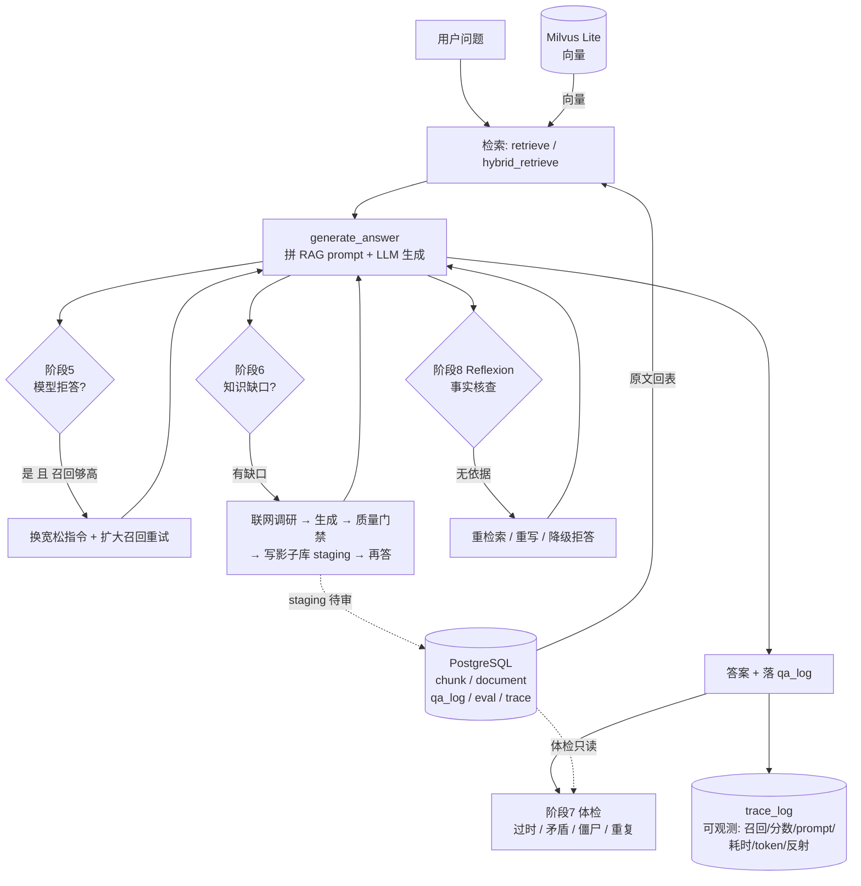

# Self-Evolving RAG Agent — 语料与评测集（起步包）

> 这是项目 **阶段 0 的地基**：真实语料 + 真实评测集。
> 没有这两样，后面所有的"优化提升"都是自嗨。

---

## 一、为什么选 FastAPI 官方中文文档

| 评估维度 | 说明 |
| --- | --- |
| 中文 | 官方中文翻译，不是机翻，术语规范 |
| 权威 | fastapi/fastapi 官方仓库，`docs/zh/docs` |
| 结构化 | `tutorial/`、`advanced/`、`deployment/` 分层清晰，有标题层级，适合结构化切片实验 |
| **边界清晰** | 语料只覆盖 FastAPI 框架知识 → "知识库里没有" 的问题非常好构造 |
| **有权威可爬站点** | `fastapi.tiangolo.com/zh/` —— 这是阶段 6 Agent 自愈时的理想爬取源 |
| 会过时 | 版本演进快，适合阶段 7 的"过时内容检测" |
| 与你的方向契合 | Python Web + AI 应用开发，和你 Java→Python/AI 的转型叙事一致 |

### 语料规模

| 项目 | 数值 |
| --- | --- |
| 文档数 | 41 篇 |
| 清洗前 | 210,742 字符 |
| **清洗后** | **179,228 字符**（去掉 15.0% 噪音） |
| 单篇最大 | `deployment__docker.md` 25KB |
| 预计切片后 | 约 350-500 个 chunk（按 512 字/块估算） |

### 清洗了什么（`scripts/clean_corpus.py`）

| 噪音类型 | 数量 | 说明 |
| --- | --- | --- |
| `{* ../../docs_src/xxx.py *}` | 206 处 | mkdocs 代码引用占位符，实际代码未包含在 md 里 |
| `/// tip \| 提示`、`//// tab \| Python 3.10+` | 若干 | mkdocs 标记行 |
| `<div class="termy">`、`<details>` | 若干 | HTML 终端模拟块、折叠块 |
| `{#first-steps}` | 若干 | 标题锚点 |

> ⚠️ **已知限制**：因为代码是占位符引用，清洗后**文档里没有完整代码示例**。
> 所以"某某功能怎么写代码"这类问题答不了——这恰恰是 Agent 自愈场景的绝佳素材（见第四节）。

---

## 二、评测集：`eval/questions.json`

**50 条，全部经过脚本校验，答案关键词确认存在于语料中。**

| 类型 | 数量 | 说明 |
| --- | --- | --- |
| `single_hop` | 36 | 答案在单篇文档内可直接找到 |
| `multi_hop` | 6 | 需综合 2 篇以上文档 |
| `unanswerable` | 8 | **语料中确实没有答案**，用于测拒答率 |

分布比例：单跳 72% / 多跳 12% / 拒答 16%

### 题目示例

```json
{
  "id": 12,
  "question": "在 FastAPI 中添加 ASGI 中间件推荐用什么方法？为什么？",
  "gold_answer": "推荐使用 app.add_middleware()，第一个参数是中间件类...",
  "gold_doc": "advanced__middleware.md",
  "answer_keywords": ["add_middleware", "第一个参数是中间件的类", "服务器错误"],
  "type": "single_hop",
  "difficulty": "medium"
}
```

### 校验方式

```bash
python eval/verify_questions.py
```

输出示例：
```
  ✓ #12 single_hop   全部 3 个关键词命中 advanced__middleware.md
  ✓ #44 拒答题（已人工确认，语料仅提及 ['AWS']）
  ...
  single_hop     通过 36/36
  multi_hop      通过 6/6
  unanswerable   通过 8/8
  ✅ 全部评测题校验通过
```

校验逻辑：
1. **可答题**：`gold_doc` 必须存在，且 `answer_keywords` 全部能在语料中命中
2. **拒答题**：检查问题核心词是否意外出现在语料中（防误标），已逐条人工确认

---

## 三、目录结构

```
rag-demo/
├── README.md                    ← 本文件
├── data/
│   ├── raw/                     ← 原始文档（41 篇，未清洗）
│   └── clean/                   ← 清洗后文档 ← 阶段 1 从这里读
├── eval/
│   ├── questions.json           ← 评测集（50 条）
│   └── verify_questions.py      ← 校验脚本
└── scripts/
    ├── fetch_docs.py            ← 重新下载语料
    └── clean_corpus.py          ← 清洗语料
```

---

## 四、★ 8 条拒答题 = Agent 自愈的完美触发用例

这是这个起步包最有价值的设计：**拒答题不是用来为难系统的，是用来演示自愈的。**

| ID | 拒答问题 | 自愈时该去哪爬 |
| --- | --- | --- |
| 43 | 如何集成 Celery 实现异步任务队列？ | fastapi.tiangolo.com 或 Celery 文档 |
| 44 | 如何把上传文件存储到 AWS S3？ | boto3 / AWS 官方文档 |
| 45 | 如何用 Strawberry 实现 GraphQL？ | strawberry.rocks |
| 46 | 如何为接口添加限流？ | slowapi / 相关文档 |
| 47 | 如何实现多租户架构？ | 需综合多篇资料 |
| 48 | 如何连接 MongoDB？ | motor / mongodb 官方 |
| 49 | 如何配置 Prometheus 监控？ | prometheus 官方 + starlette exporter |
| 50 | 如何做 A/B 测试？ | 需综合资料 |

**完整演示流程**（阶段 6 做出来后就是这样的效果）：

```
1. 问："FastAPI 如何集成 Celery？"
   → 检索：最高分 0.31，低于阈值 0.5
   → 判定：知识缺口 ✓

2. Agent 自主调研
   → 搜索 "FastAPI Celery integration"
   → 抓取正文、去广告

3. 生成结构化文档《FastAPI 集成 Celery 指南.md》

4. 质量门禁打分：0.82 ≥ 0.7 ✓

5. 写入影子库（status='staging'），不污染主库

6. 再问同一个问题
   → 现在能答对了，并标注来源为"Agent 生成，待验证"
```

> 这个 demo 演示效果极佳：**从"答不了"到"自己学会"的全过程可视化**，
> 而且是 Dify / RAGFlow 完全做不到的（它们是固定工作流，不会自己决定"要不要去学"）。

---

## 五、拉取代码后怎么跑起来（新人上手）

> 手把手详细版见 **`docs/14-拉取代码后如何跑起来.md`**。这里是最短路径。

### 5.0 先搞清：哪些东西**不在** git 里，以及为什么

别人 clone 下来**不能直接跑**，缺的就是下面这些。它们不是"忘了提交"，而是**故意不入库**（体积大 / 含密码 / 可再生产）：

| 不在仓库里 | 体积 | 为什么不入库 | 你要做什么 |
| --- | --- | --- | --- |
| `models/BAAI__bge-small-zh-v1.5/` | **183MB** | 模型权重体积大，且能随时重新下载 | `python scripts/fetch_model.py`（走 ModelScope，国内可用） |
| `data/milvus.db` | 4.2MB | 运行时产物，可从 PG 原文重建 | **通常不用管**：首次入库会自动建；想有数据就跑 `python scripts/ingest.py` |
| `.env` | — | **含真实密码，推上去=社死** | `cp .env.example .env` 再填 |
| `.venv/` | 1.4GB | 依赖装在本地，不入库 | `pip install -r requirements.txt` |
| `frontend/node_modules/` | 195MB | 同上 | `cd frontend && npm install` |
| `frontend/dist/` | 1.3MB | 构建产物 | 开发用 `npm run dev`；要部署才 `npm run build` |
| `corpus/clean/`（41 篇） | 380KB | ✅ **已经入库了** | 什么都不用做，可直接入库 |
| `eval/questions.json`（50 题） | — | ✅ **已经入库了** | 什么都不用做 |

> **不要**为了"让别人能跑"就把 `models/` 和 `data/` 提交进 git——183MB 的模型和向量库塞进 git 会让 clone 变成几分钟，而且向量库和模型版本必须匹配，别人拿到你的 `milvus.db` 配上自己下的模型反而容易出错。**正确做法是让别人自己生成**：下模型 + 重新入库（几分钟的事，`corpus/clean` 已入库所以离线可做）。

### 5.1 最短路径（记得把 LLM 二选一）

```bash
git clone <仓库地址> && cd Self_Evolving_RAG_Agent

# ① 后端依赖（国内强烈建议加清华源，torch 走默认源会慢到怀疑人生）
python3 -m venv .venv
.venv/bin/pip install -r requirements.txt -i https://pypi.tuna.tsinghua.edu.cn/simple/

# ② embedding 模型（183MB，从 ModelScope 下，不需翻墙）
.venv/bin/python scripts/fetch_model.py

# ③ 起一个 PostgreSQL（本地 Docker 最省事；云上 PG 那套见 docs/14）
docker run -d --name rag-pg -p 5432:5432 \
  -e POSTGRES_USER=rag -e POSTGRES_PASSWORD=rag_dev -e POSTGRES_DB=rag postgres:16

# ④ 配置
cp .env.example .env
#   至少改这两个：PG_PASSWORD=rag_dev，以及 LLM 部分（见下）
${EDITOR:-vi} .env

# ⑤ 入库（把已在仓库里的 corpus/clean 灌进 PG + Milvus）
.venv/bin/python scripts/ingest.py

# ⑥ 起服务：后端起 8000，前端起 5173
.venv/bin/python scripts/api.py                  # → http://127.0.0.1:8000/docs
cd frontend && npm install && npm run dev        # → http://127.0.0.1:5173
```

**LLM 二选一**（`.env` 里改）：

| 方案 | 配置 | 说明 |
| --- | --- | --- |
| 云 API（推荐，快） | `LLM_BACKEND=openai`<br>`LLM_MODEL=qwen3.7-max`<br>`OPENAI_API_KEY=sk-xxx`<br>`OPENAI_BASE_URL=https://dashscope.aliyuncs.com/compatible-mode/v1` | 阿里云百炼 / 任意 OpenAI 兼容端点 |
| 纯本地免费 | `LLM_BACKEND=ollama`<br>`LLM_MODEL=qwen2.5:7b` | 需先装 [Ollama](https://ollama.com) 并 `ollama pull qwen2.5:7b` |

**一条命令版**（把上面 ①②③④ 自动做完，然后你自己跑 ⑤⑥）：

```bash
bash scripts/setup_new_machine.sh
```

> 另有 `scripts/setup_local.sh`，那是**作者本人**"本地开发复用自己云上 PG + 向量库"用的，
> 需要你自己的云主机 + SSH 隧道，新人不适用（脚本会明确提示而不是去连陌生服务器）。

### 5.2 启动后的自检清单

| # | 命令 | 期望 |
| --- | --- | --- |
| 1 | `.venv/bin/python -c "from core import config; print(config.validate())"` | `[]` |
| 2 | `curl localhost:8000/api/health` | `{"status":"ok", ...}`（degraded = PG 没通） |
| 3 | `curl localhost:8000/api/stats` | documents/chunks/vectors 都有数字 |
| 4 | 打开 `localhost:5173` | 顶栏状态灯绿色 `● 在线` |

---

## 六、复用与扩展

**换语料**：改 `scripts/fetch_docs.py` 里的 `TARGETS` 列表即可。
想换主题（比如换成 LangChain 文档），只要保证三点：
1. 有明确的领域边界
2. 有权威的可爬站点
3. 能构造出"确实答不了"的问题

**扩评测集**：往 `eval/questions.json` 里加，然后跑 `verify_questions.py` 校验。
建议最终规模 80-100 条（现在 50 条够起步）。

---

## 七、运行入口（阶段 1~10 全链路）

语料与评测集只是地基。真正能跑的 RAG Agent 在 `core/` + `scripts/` + `frontend/` 里：

| 入口 | 文件 | 用途 | 启动命令 |
| --- | --- | --- | --- |
| **环境搭建** | `scripts/setup_new_machine.sh` | **新人/换机器**：全本地一键搭建（装依赖 + 下模型 + 起 PG + 写 .env） | `bash scripts/setup_new_machine.sh` |
| 环境搭建 | `scripts/setup_local.sh` | 作者本人：本地开发复用自己云上 PG + 向量库 | `RAG_CLOUD_HOST=root@你的IP bash scripts/setup_local.sh` |
| 命令行 | `scripts/ask.py` | 终端问答 / 调试 | `python scripts/ask.py "FastAPI 怎么做依赖注入？" [--retrieval hybrid] [--self-heal] [--agent-heal] [--reflect] [--trace]` |
| 自愈 CLI | `scripts/heal_knowledge.py` | 阶段6 缺口自愈 / Demo | `python scripts/heal_knowledge.py "知识库没有的概念" [--site docs.python.org] [--file q.txt]` |
| 体检 CLI | `scripts/health_check.py` | 阶段7 知识库体检 | `python scripts/health_check.py [--no-conflict] [--report out.md]` |
| HTTP 服务 | `scripts/serve.py` | 阶段4 服务化（FastAPI） | `python scripts/serve.py` → http://127.0.0.1:8000/docs |
| 页面 | `scripts/ui.py` | 阶段 5/6/7/8 可视化（Streamlit：问答 / 体检 / 链路追踪 三标签页） | `streamlit run scripts/ui.py` → http://localhost:8501 |
| **前端 API** | `scripts/api.py` | **阶段 10** 前端要打的全 API（KB 管理 + 问答 + 检索测试 + 体检 + 追踪 + **入库任务轮询**，共 14 个） | `python scripts/api.py` → http://127.0.0.1:8000/docs |
| **前端页面** | `frontend/` | **阶段 10** 仿 RAGFlow 风格（React + Vite + AntD：知识库 / 问答 / 检索测试 / 体检 / 链路追踪 五页，知识库页含**解析异步进度条**） | `cd frontend && npm install && npm run dev` → http://127.0.0.1:5173 |

> - `--agent-heal` 与 `heal_knowledge.py`：阶段 6 闭环（缺口→联网调研→生成→门禁→写影子库 staging→再问能答）。
> - `--reflect`（阶段 8）：生成答案后做一次事实核查，发现无依据的断言就重检索/重写，仍不通过则降级为安全拒答。
> - `--trace`（阶段 8）：把本次问答的召回/分数/prompt/耗时/估算 token/反射结果写入 `trace_log` 表，供可观测看板。

首次运行/换了机器/别人拉取代码 → **先看第五节**（或 `docs/14-拉取代码后如何跑起来.md`）：

```bash
bash scripts/setup_new_machine.sh      # 全本地一键搭建（装依赖+下模型+起PG+写.env）
.venv/bin/python scripts/ingest.py     # 入库
.venv/bin/python scripts/api.py        # 起后端
```

> 如果你（作者）的 PG 在云上，开发前先开隧道；该脚本**必须显式指定云主机**，故意不给默认值：
> ```bash
> RAG_CLOUD_HOST=root@你的IP bash scripts/tunnel_pg.sh    # .env 里 PG_HOST=localhost
> ```

各阶段详解见 `docs/`：
- `docs/01-阶段1-切片与双存储.md`
- `docs/02-阶段2-RAG闭环.md`
- `docs/03-阶段3-评估闭环.md`
- `docs/04-阶段4-检索优化与自进化闭环.md`（算法层：BM25 混合检索）
- `docs/05-阶段5-Agent自愈.md`（逻辑层：拒答检测 + 重试）
- `docs/06-阶段4-服务化.md`（服务层：FastAPI）
- `docs/07-阶段5-streamlit页面.md`（UI 层：Streamlit）
- `docs/08-阶段6-Agent自愈闭环.md`（阶段6：缺口自愈 + 影子库防投毒）
- `docs/09-阶段7-知识库体检.md`（阶段7：过时/矛盾/僵尸/重复 四检测器 + 健康报告）
- `docs/10-阶段8-Reflexion与可观测.md`（阶段8：反射自检闭环 + trace_log 链路追踪）
- `docs/11-阶段9-包装发布.md`（阶段9：架构图 / 效果对比表 / 已知限制 / 简历 bullets）
- `docs/12-前端-React知识库页面.md`（阶段10：仿 RAGFlow 风格的前端 + 知识库管理 API）
- `docs/13-项目完整介绍与操作手册.md`（★ **推荐先读这份**：技术栈 / 目录结构 / 从入口开始的完整使用流程 / 5 个页面操作详解 / 14 个 API / 存储模型 / 排障 FAQ）
- `docs/14-拉取代码后如何跑起来.md`（★ **新人上手 / 换机器**：哪些东西不在 git 里、怎么补、三种场景、常见报错速查）

---

## 八、系统架构（阶段 1~10 全景）



**分层（和代码目录一一对应）**

| 层 | 模块 | 职责 |
|---|---|---|
| 数据层 | `core/chunker.py` `core/embedder.py` `core/storage/*` | 切片、bge 编码、双存储（PG 原文 + Milvus 向量） |
| 检索层 | `core/retrieval.py` `core/bm25.py` | 向量检索、BM25 混合检索（RRF 融合） |
| 生成层 | `core/rag.py` `core/prompt.py` `core/llm.py` | 拼 prompt、调 LLM、答案落库（单一事实来源） |
| 自愈层 | `core/self_heal.py`(阶段5) `core/agent.py`(阶段6) | 拒答自救、缺口联网补库 + 影子库防投毒 |
| 质检层 | `core/reflexion.py`(阶段8) `core/health_check.py`(阶段7) | 事实核查闭环、知识库体检 |
| 可观测 | `core/tracing.py` + `trace_log` | 链路追踪落库 |
| 评估 | `core/evaluator.py` | LLM-as-judge 打分，指标落 `eval_run` |
| 入口 | `scripts/ask.py` `serve.py` `ui.py` `api.py` `heal_knowledge.py` `health_check.py` + `frontend/` | CLI / HTTP / Streamlit / 前端 API / 自愈 Demo / 体检 / React 前端 |

## 九、效果对比表（指标口径与预期方向）

> 真实数值由 `python scripts/evaluate.py` 实跑获得，结果自动落 `eval_run` 表；
> 下表给出**指标口径与各阶段带来的预期方向**，标 `示例` 的格子需你实跑后替换。

| 配置（A/B 对照） | accuracy | recall_top1 | refusal_rate（拒答正确率） | 说明 |
| --- | --- | --- | --- | --- |
| 纯向量 baseline（阶段 1~2） | 基线 | 基线 | 基线 | 见 `eval_run` 最早一条 |
| + 混合检索（阶段 4） | ↑ | ↑ | ≈ | 同义改写/精确词召回改善（RRF 融合） |
| + 拒答自愈（阶段 5） | ↑ | — | ↑ | 救回 over-refusal（recall 够高却误拒） |
| + 缺口自愈（阶段 6） | 覆盖原 8 道 unanswerable | — | — | 自动联网补库，原拒答题变可答 |
| + Reflexion（阶段 8） | 幻觉率 ↓ | — | — | 拦截"无依据断言"，仍不过则降级拒答 |

`scripts/evaluate.py` 输出的核心指标：`accuracy`（裁判=2 比例）、`partial_rate`、`refusal_rate`、
`recall_top1/recall_top3`、`avg_latency_s`、`healed_count`（阶段5 救回数）。**横向比两次 run 的数字**即知优化是否生效。

## 十、已知限制（诚实清单）

1. **数据源是起步包**：语料为 FastAPI 官方中文文档（41 篇），文档里**没有完整代码示例**
   （代码是占位符引用），"怎么写代码"类问题答不了——这恰好是阶段 6 自愈的演示素材。
2. **依赖外网**：阶段 6 联网调研走 DuckDuckGo HTML 版（免 Key、纯 urllib），某些网络环境会被限流；
   失败优雅降级（不抛异常、不入库）。生产建议换商业搜索 API（接口已可注入）。
3. **防投毒靠"人工转 active"**：阶段 6 自动补的内容只进 `staging`，绝不自动进主库；
   转 active 由阶段 7 体检报告提示、人工执行（最后一公里）。
4. **矛盾检测只做文档内**：跨文档矛盾需按 embedding 聚类再细查（成本高，暂未做）。
5. **Reflexion 也是 LLM 判断**：可能误判；默认 `REFLECT_MAX_RETRY=1` 控成本，按需开启 `--reflect`。
6. **token 为估算值**：`字符数/4` 启发式，非精确（见 `core/tracing.py`）。
7. **非分布式**：Milvus 用 Lite（本地文件），向量库同进程 upsert 后立即可检索；
   跨进程部署需显式 `ensure_loaded`（见 `core/storage/vec_store.py` 注释）。

## 十一、简历 bullets（定稿）

> 一个"能自己学习、自己体检、自己核查"的 RAG Agent，从 0 到 1 全栈落地。

- **数据层**：实现 Markdown/PDF/DOCX/HTML 格式无关的切片器，bge 向量 + PostgreSQL 双存储（向量库只存 ID，原文与元数据落 PG，支持事务与按元数据过滤）。
- **检索层**：纯向量 + BM25 关键词混合检索（RRF 倒数排名融合，消除量纲差异），基于 `eval_run` 做 A/B 评估驱动优化。
- **生成层**：抽离 `generate_answer` 单一事实来源，CLI / FastAPI / Streamlit 三入口共用，杜绝口径漂移。
- **自愈闭环（Self-Evolving 核心）**：① 拒答自愈（阶段5，识别 over-refusal 换策略重试）；② 缺口自愈（阶段6，联网调研→LLM 生成→质量门禁→写影子库→再答），并设计"影子库 + LLM 门禁 + 未验证标签"三重防投毒。
- **质检闭环**：开发知识库体检 Agent（阶段7，检测过时/矛盾/僵尸/重复四类问题并产出 Markdown 健康报告）；引入 Reflexion 事实核查（阶段8，无依据断言自动重检索/重写，仍不过则降级拒答）。
- **可观测**：链路追踪落 PG（`trace_log`：召回/分数/prompt/耗时/估算 token/反射结果），配合 LLM-as-judge 评估闭环量化效果。
- **工程纪律**：纯标准库 urllib 实现联网调研（零重依赖），全链路可注入桩做单测，依赖/配置/模型后端均可通过环境变量插拔。

---

*生成时间：2026-09-09（地基）｜ 运行入口更新：2026-09-11（阶段1~10）｜ 文档补全：2026-09-11（阶段7/8/9）｜ 前端：2026-09-11（阶段10 React + RAGFlow 风格）｜ 语料来源：github.com/fastapi/fastapi @master (docs/zh/docs)*

