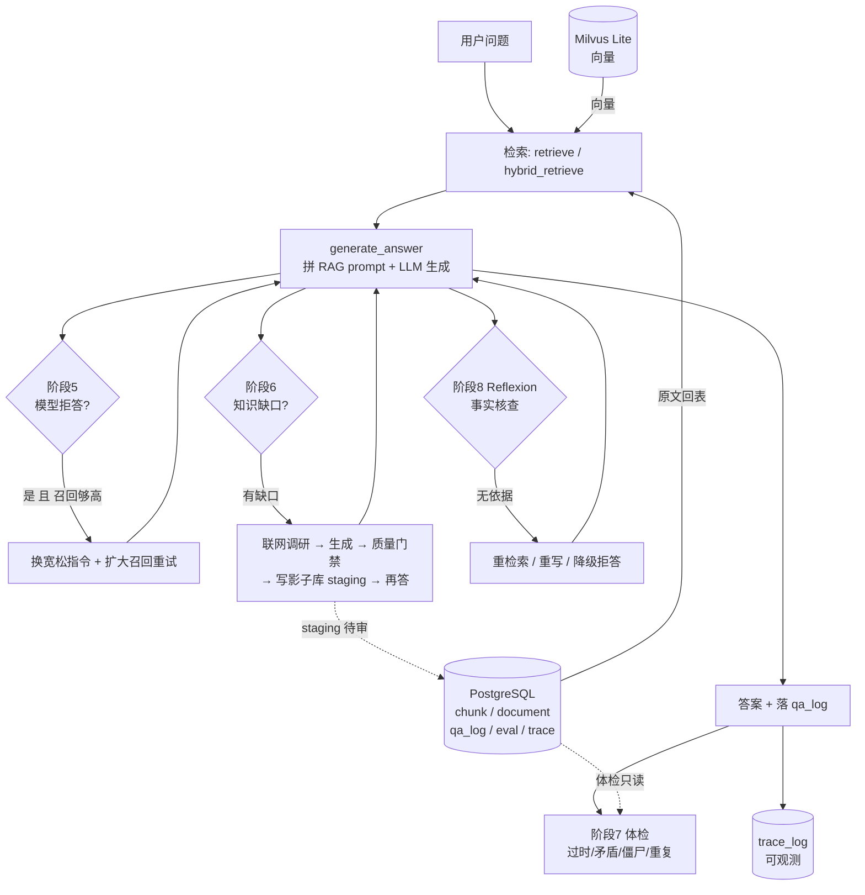

# Self-Evolving RAG Agent · 项目完整介绍与操作手册

> 本文档的目标读者：**第一次拿到这个项目、想把它完整跑起来并逐个功能用一遍的人**。
> 所以它不只是"介绍"，更像一份**操作手册**——从"这是什么"写到"每个按钮干什么"，
> 前后端技术栈、目录结构、启动命令、接口契约、数据模型、排障方法全部覆盖。
>
> 阅读顺序建议：第 1 章 → 第 2 章 → 第 5 章（跑起来）→ 第 6~10 章（按页面用一遍）。
> 已经跑起来、只想查细节的人，直接跳到第 11 章（API）和第 13 章（存储模型）。
>
> 与其他文档的关系：`docs/01`~`docs/12` 是**按开发阶段**写的实现笔记（为什么这么设计、踩了什么坑）；
> 本文是**横向的、面向使用**的总览与手册。两者互补，不重复。

---

## 目录

| 章节 | 内容 |
| --- | --- |
| 1 | [这个项目是什么](#1-这个项目是什么) |
| 2 | [技术栈总览（前后端全列）](#2-技术栈总览前后端全列) |
| 3 | [目录结构](#3-目录结构) |
| 4 | [从入口开始：三种使用方式](#4-从入口开始三种使用方式) |
| 5 | [环境准备：从零到跑起来](#5-环境准备从零到跑起来) |
| 6 | [功能详解 ①：知识库管理页](#6-功能详解--知识库管理页) |
| 7 | [功能详解 ②：问答页](#7-功能详解--问答页) |
| 8 | [功能详解 ③：检索测试页](#8-功能详解--检索测试页) |
| 9 | [功能详解 ④：知识库体检页](#9-功能详解--知识库体检页) |
| 10 | [功能详解 ⑤：链路追踪页](#10-功能详解--链路追踪页) |
| 11 | [后端 API 全清单](#11-后端-api-全清单) |
| 12 | [架构与数据流](#12-架构与数据流) |
| 13 | [存储模型](#13-存储模型) |
| 14 | [配置项参考](#14-配置项参考) |
| 15 | [常见问题与排障 FAQ](#15-常见问题与排障-faq) |
| 16 | [已知限制（诚实清单）](#16-已知限制诚实清单) |
| 17 | [附录：阶段 1~10 功能全清单](#17-附录阶段-110-功能全清单) |

---

## 1. 这个项目是什么

**一句话**：一个"**会自己发现自己不会、然后自己去学**"的 RAG（检索增强生成）问答系统，从语料、检索、生成，到自愈、体检、可观测，再到仿 RAGFlow 的 Web 前端，**全栈从 0 到 1 手写落地**。

**它解决什么痛点**：普通 RAG 系统是"死"的——知识库里没有的东西，它永远答不出来（或者硬编瞎答）。本项目的三个"活"的能力：

| 能力 | 阶段 | 通俗解释 |
| --- | --- | --- |
| **拒答自愈** | 5 | 模型明明检索到了有用内容却拒绝回答（over-refusal）→ 换更宽松的指令 + 扩大召回，再试一次 |
| **缺口自愈**（核心） | 6 | 检索分数低于阈值 = 知识库真不会 → **自动联网调研 → 生成结构化文档 → 质量门禁打分 → 写入影子库 staging → 再问就能答** |
| **事实核查**（Reflexion） | 8 | 答案生成后做一次自我事实审查，发现"没有依据的断言"就重检索/重写，仍不过就降级为安全拒答 |

**与 Dify / RAGFlow 的区别**：Dify、RAGFlow 是**固定工作流**——你规定的流程它照跑，但它不会自己决定"我要不要去学"。本项目在问答链路上插入了**判定节点**（缺口？幻觉？），由系统自己决定是否触发学习动作。

**能力全景（按用户能看到的界面能力分）**：

1. 📚 **知识库管理**：拖拽上传文件 → 自动解析/切片/向量化/入库，带**异步实时进度条**；文档列表、切片查看、删除。
2. 💬 **问答**：带 6 个策略开关（检索模式/top_k/拒答自愈/缺口自愈/事实核查/链路追踪），答案带召回上下文可视化。
3. 🔍 **检索测试**：只召回不生成，专门用来定位"是检索的问题还是生成的问题"。
4. 🩺 **知识库体检**：四个检测器（过时/矛盾/僵尸/重复）+ 健康报告 + 影子库待审列表。
5. 🔗 **链路追踪**：每次问答的召回、分数、prompt、耗时、token、反射结果全部落库可查。

---

## 2. 技术栈总览（前后端全列）

### 2.1 后端

| 层 | 技术 | 版本/规格 | 用途 |
| --- | --- | --- | --- |
| 语言 | **Python** | 3.11+（实测 3.13 可用） | 全部后端逻辑 |
| Web 框架 | **FastAPI** | 0.11x | HTTP 接口、自动 OpenAPI/Swagger 文档 |
| ASGI 服务器 | **Uvicorn** | — | 起服务（`reload=False`，避免热重载搞乱进程级单例） |
| 数据校验 | **Pydantic** | v2 | 请求体模型（`AskRequest` / `RetrieveRequest` / `HealthCheckRequest`） |
| 文件上传 | `UploadFile` + `python-multipart` | — | multipart/form-data 批量收文件 |
| 并发模型 | **threading**（标准库） | — | 异步入库任务（后台线程 + 内存任务表），**不引** Celery/RQ/Redis |
| 关系库 | **PostgreSQL** + **psycopg2** | PG 16 | 存 chunk 原文、文档元数据、问答日志、评估结果、trace |
| 向量库 | **Milvus Lite** + **pymilvus** | pymilvus 3.x / milvus-lite | 只存向量 + chunk_id + doc_id（**单一文件** `data/milvus.db`，无需起服务） |
| Embedding | **sentence-transformers** + **BAAI/bge-small-zh-v1.5** | 512 维，约 100MB | 中文语义向量 |
| LLM | **OpenAI 兼容 API**（默认阿里云百炼 `qwen3.7-max`）/ **Ollama**（本地免费） | 可插拔 | 生成答案、质量门禁、LLM-as-judge 打分、矛盾检测、事实核查 |
| 联网调研 | **urllib**（纯标准库） | — | 阶段 6 搜索 + 抓正文，零第三方依赖 |
| 配置 | **python-dotenv** | — | `.env` → 环境变量 |
| 评估 | 自研 `core/evaluator.py` | — | LLM-as-judge 打分，指标落 `eval_run` / `eval_result` 表 |

> **后端的两个 HTTP 入口，别搞混**：
> - `scripts/serve.py` —— **阶段 4** 的最小服务（`/health` + `/ask`），面向"把 RAG 包成 HTTP"的教学演示。
> - `scripts/api.py` —— **阶段 10** 的前端专用全量 API（14 个接口），**前端只打这个**。
> 两者并存是有意为之：扩 `serve.py` 会让阶段 4 和阶段 10 的代码混在一起，历史回看不友好。

### 2.2 前端

| 技术 | 版本 | 用途 |
| --- | --- | --- |
| **React** | 18.3 | 组件化 UI |
| **Vite** | 5.4 | 开发服务器（HMR）+ 生产构建 |
| **Ant Design (antd)** | 5.21 | 企业级组件库（Table / Card / Steps / Progress / Drawer / Upload …）；主题见 `theme.js` |
| **@ant-design/icons** | 5.5 | 图标 |
| **React Router** | 6.26 | 前端路由（6 条路由，5 个页面） |
| **Axios** | 1.7 | HTTP 客户端（统一 baseURL + 响应拦截器弹错） |
| **react-markdown** | 9.0 | 渲染 Markdown（健康报告、含 GFM 表格） |
| **remark-gfm** | 4.0 | Markdown 的表格 / 任务列表 / 删除线等 GFM 扩展 |
| 原生 **XMLHttpRequest** | — | 上传时拿**字节上传进度**（`fetch` 拿不到 `upload.onprogress`） |

**前端工程细节**：

- `vite.config.js` 里配了 **dev proxy**：`/api` → `http://127.0.0.1:8000`。
  所以前端代码里写 `baseURL = "/api"` 就能直接打后端，**既避开 CORS（虽然后端也开了 `*`），又让前后端可独立部署**。
- 生产构建：`npm run build` → `frontend/dist/`（约 1.38MB / gzip 437KB），可丢到任意静态服务器。
- AntD 中文语言包（`antd/locale/zh_CN`）+ `ConfigProvider` 注入自定义主题。

### 2.3 前后端怎么连起来的（一张图看懂）

```
浏览器 http://127.0.0.1:5173
   │  axios baseURL="/api"  →  请求 /api/documents
   ▼
Vite dev server (:5173)  ──proxy──▶  FastAPI (:8000)  ──▶  core/* 业务逻辑
   （开发时）                            （scripts/api.py）      │
                                                               ├─▶ PostgreSQL（原文/元数据/日志）
                                                               ├─▶ Milvus Lite（向量）
                                                               ├─▶ bge 模型（本地）
                                                               └─▶ LLM（百炼 / Ollama）
```

---

## 3. 目录结构

```
Self_Evolving_RAG_Agent/
├── README.md                     项目总览（语料/评测集/架构/简历 bullets）
├── .env                          ★ 本机真实配置（含密码，不进 git）
├── .env.example                  ★ 配置模板（可入仓）
├── .env.cloud                    云上部署版配置
│
├── core/                         ★ 后端业务核心（与入口解耦，可被 CLI/HTTP/前端复用）
│   ├── config.py                 全局配置（环境变量 > .env > 默认），validate() / summary()
│   ├── chunker.py                切片器：FixedChunker / StructuralChunker / RecursiveChunker
│   ├── embedder.py               bge 编码器（支持分批 + 进度回调）
│   ├── ingest.py                 ★ 入库流水线：ingest_text / ingest_file（带分阶段进度回调）
│   ├── llm.py                    LLM 客户端（ollama / openai 两种后端，统一接口）
│   ├── prompt.py                 RAG prompt 拼装（含"不要瞎编"的约束）
│   ├── rag.py                    ★ generate_answer：单一事实来源的问答函数
│   ├── retrieval.py              retrieve（纯向量）/ hybrid_retrieve（向量+BM25，RRF 融合）
│   ├── bm25.py                   自研 BM25（倒排 + k1/b 参数）
│   ├── self_heal.py              阶段 5：拒答自愈
│   ├── agent.py                  阶段 6：缺口自愈闭环（联网调研→生成→门禁→影子库）
│   ├── health_check.py           阶段 7：四个检测器（过时/矛盾/僵尸/重复）
│   ├── reflexion.py              阶段 8：事实核查闭环
│   ├── tracing.py                阶段 8：链路追踪（估算 token = 字符数/4）
│   ├── evaluator.py              阶段 3：LLM-as-judge 打分
│   └── storage/
│       ├── pg_store.py           PostgreSQL 封装（建表 + 各表 CRUD + 统计）
│       └── vec_store.py          Milvus Lite 封装（建集合/upsert/search/delete_by_doc_id）
│
├── scripts/                      ★ 各入口脚本（CLI / HTTP / 前端 API）
│   ├── api.py                    ★★ 前端要打的全量 API（14 接口，含异步入库任务）
│   ├── serve.py                  阶段 4 最小 HTTP 服务
│   ├── ui.py                     阶段 5~8 的 Streamlit 可视化（老 UI，保留）
│   ├── ask.py                    命令行问答（所有开关齐全）
│   ├── heal_knowledge.py         阶段 6 自愈 Demo CLI
│   ├── health_check.py           阶段 7 体检 CLI
│   ├── ingest.py                 批量入库 CLI
│   ├── evaluate.py               阶段 3 评估 CLI（带 A/B 对比）
│   ├── search.py                 纯检索调试（只召回）
│   ├── fetch_docs.py             下载语料
│   ├── clean_corpus.py           清洗语料
│   ├── fetch_model.py            从 ModelScope 下模型（国内可用）
│   ├── setup_new_machine.sh      ★ 新人/换机器：全本地一键搭建（不依赖任何云主机）
│   ├── setup_local.sh            作者本人：本地开发复用自己云上 PG + 向量库
│   ├── tunnel_pg.sh              SSH 隧道连云上 PG（需 RAG_CLOUD_HOST）
│   ├── verify_storage.py         存储自检
│   ├── peek_vec.py               向量库查看
│   └── selftest_stage6/7/8.py    三个阶段的自测脚本
│
├── frontend/                     ★ 前端工程（React + Vite + AntD）
│   ├── package.json              依赖清单
│   ├── vite.config.js            dev proxy / build 配置
│   ├── index.html                入口 HTML
│   └── src/
│       ├── main.jsx              挂载点：ConfigProvider(zhCN + theme) + AntApp + BrowserRouter
│       ├── App.jsx               路由表（6 条路由）
│       ├── api.js                axios 实例 + 响应拦截器
│       ├── theme.js              AntD 主题定制
│       ├── App.css               全局样式（顶栏/侧栏/聊天气泡/状态徽章…）
│       └── components/
│           ├── Layout.jsx        顶栏 + 侧边菜单 + 内容区（含在线/降级状态灯）
│           ├── KnowledgeBase.jsx ① 知识库管理（上传 + 文档表 + 切片抽屉 + 异步进度条）
│           ├── Chat.jsx          ② 问答（6 开关 + 召回块折叠）
│           ├── Retrieval.jsx     ③ 检索测试
│           ├── Health.jsx        ④ 知识库体检
│           └── Traces.jsx        ⑤ 链路追踪
│
├── docs/                         按阶段写的实现笔记 01~12 + 本文 13
├── corpus/clean/                 清洗后的语料（41 篇 FastAPI 中文文档，179K 字符）
├── eval/                         questions.json（50 条评测题）+ verify_questions.py
├── models/BAAI__bge-small-zh-v1.5/   ★ 本地 embedding 模型（约 183MB）
└── data/milvus.db/               ★ Milvus Lite 向量库（目录，约 2.6MB）
```

---

## 4. 从入口开始：三种使用方式

项目有**三个入口**，共用同一套 `core/` 业务逻辑（所以口径不会漂移）：

```
                    ┌──────────────────────────────┐
   入口 A 浏览器 ──▶│ scripts/api.py (FastAPI :8000)│──┐
      (frontend/)   └──────────────────────────────┘  │
                    ┌──────────────────────────────┐  │
   入口 B HTTP ────▶│ /docs Swagger / curl         │  ├──▶  core/*
      (调试/集成)    └──────────────────────────────┘  │      （单一事实来源）
                    ┌──────────────────────────────┐  │
   入口 C 命令行 ──▶│ scripts/ask.py 等 CLI        │──┘
      (脚本/批处理)  └──────────────────────────────┘
```

### 入口 A：浏览器（React 前端）—— ★ 主入口

这是项目的**主要使用方式**。启动两个进程：

```bash
# 终端 1：后端
cd <你的项目路径>/Self_Evolving_RAG_Agent
bash scripts/tunnel_pg.sh                  # 若 PG 在云上，先开隧道（保持开着；需 RAG_CLOUD_HOST）
.venv/bin/python scripts/api.py            # → http://127.0.0.1:8000

# 终端 2：前端
cd frontend
npm install                                # 首次
npm run dev                                # → http://127.0.0.1:5173
```

> 🆕 **第一次跑 / 换机器 / 别人拉取代码**：上面这套假设你已经有 PG 和向量库了。
> 从零开始的完整步骤（下模型、起 PG、入库、配 .env）见 **`docs/14-拉取代码后如何跑起来.md`**。

浏览器打开 **http://127.0.0.1:5173**，默认跳到「知识库」页。左侧 5 个菜单：

| 菜单 | 路由 | 页面 |
| --- | --- | --- |
| 📚 知识库 | `/knowledge` | 上传 / 文档列表 / 切片查看 / 删除 |
| 💬 问答 | `/chat` | 带 6 个开关的问答 |
| 🔍 检索测试 | `/retrieval` | 只召回不生成 |
| 🧪 知识库体检 | `/health` | 四检测器 + 健康报告 |
| 🔗 链路追踪 | `/traces` | 问答 trace 列表 |

顶栏右侧有**后端状态灯**：绿色 `● 在线` = `/api/health` 返回 ok；黄色 `● 降级` = 存储/LLM 有问题（页面仍可用，但相关功能会报错）。

### 入口 B：HTTP API（FastAPI）

```bash
.venv/bin/python scripts/api.py --host 0.0.0.0 --port 8080
# 浏览器打开 http://127.0.0.1:8000/docs  （FastAPI 自带 Swagger，可直接试接口）
```

适合：写小程序对接、用 curl 排查、给别人演示接口契约。详见[第 11 章](#11-后端-api-全清单)。

### 入口 C：命令行 CLI

| 命令 | 用途 |
| --- | --- |
| `.venv/bin/python scripts/ask.py "问题"` | 终端问答，支持 `--retrieval` / `--self-heal` / `--agent-heal` / `--reflect` / `--trace` |
| `.venv/bin/python scripts/ingest.py` | 批量把 `corpus/clean/` 入库 |
| `.venv/bin/python scripts/heal_knowledge.py "知识库没有的概念"` | 阶段 6 自愈 Demo（会真的联网+写库） |
| `.venv/bin/python scripts/health_check.py --report out.md` | 阶段 7 体检，导出 Markdown 报告 |
| `.venv/bin/python scripts/evaluate.py` | 阶段 3 评估（50 题跑分，落 `eval_run`） |
| `.venv/bin/python scripts/search.py "问题"` | 纯检索调试 |

**注意**：所有 CLI **必须在项目根目录下执行**（脚本靠 `sys.path` 找 `core`）。比如 `python scripts/api.py` 报 `ModuleNotFoundError: No module named 'scripts'` 就是因为没在根目录。

---

## 5. 环境准备：从零到跑起来

### 5.1 前置条件

| 需要 | 说明 |
| --- | --- |
| Python 3.11+ | 推荐用虚拟环境（`.venv` 或 conda） |
| Node.js 18+ | 前端构建（实测 Node 22 可用） |
| PostgreSQL | 本地 Docker 起一个最简的即可（见下）；**或**复用云上 PG + SSH 隧道 |
| （可选）Ollama | 想完全本地免费跑 LLM 时装；否则用 OpenAI 兼容的云 API |

### 5.2 后端：依赖 + 模型

**依赖清单**：直接装 **`requirements.txt`**（仓库根目录，已按 核心 / 可选 分组并带注释）：

```bash
pip install -r requirements.txt
# 国内加速（强烈建议，torch 走默认源会慢到怀疑人生）
pip install -r requirements.txt -i https://pypi.tuna.tsinghua.edu.cn/simple/
```

主要内容：`fastapi` `uvicorn` `python-multipart` `pydantic`（Web）、
`psycopg2-binary` `pymilvus` `milvus-lite`（存储）、`sentence-transformers` `numpy`（embedding）、
`python-dotenv`（配置）；可选：`streamlit`（老 UI）、`httpx`（自测）、`pdfplumber` `python-docx`（上传 PDF/DOCX 才需要）。

> ⚠ `torch` 由 `sentence-transformers` 连带安装，**Linux 上 pip 默认给 CUDA 版（2~3GB）**。
> 只用 CPU 就先手动装 CPU 版再装本文件，能省 90% 时间——具体命令写在 `requirements.txt` 头注释里。

> **国内安装加速**：`pip install -i https://pypi.tuna.tsinghua.edu.cn/simple/ ...`
> **torch 会拖 2~3GB 的 CUDA 版**：用得着 GPU 才装 CUDA 版；纯 CPU 建议先 curl 下 `+cpu` 的 wheel 再本地装
> （`https://mirrors.aliyun.com/pytorch-wheels/cpu/`，实测 176MB / 13 秒）。

**下载 embedding 模型**（huggingface 在国内不通，走 ModelScope）：

```bash
.venv/bin/python scripts/fetch_model.py
# 结果落在 models/BAAI__bge-small-zh-v1.5/（约 183MB）
```

`core/config.py` 会自动检测：本地有这个目录就用本地路径，否则退回 HF 官方 id。

**一键脚本**（两个，按你的情况选）：

```bash
# A) 新人 / 换机器 / 别人拉取代码：全本地，不依赖任何人的云主机 ★ 推荐
bash scripts/setup_new_machine.sh
#    做的事：建 .venv → 装 requirements.txt → 下模型 → 起本地 Docker PG → 写 .env → 自检

# B) 作者本人：本地开发复用自己云上的 PG + 向量库（需要你自己的云主机）
RAG_CLOUD_HOST=root@你的服务器IP bash scripts/setup_local.sh
#    做的事：建 .venv → 装依赖 → 下模型 → scp 云上 milvus.db → 写 .env → 自检
#    ⚠ 跑完记得手动往 .env 填云上 PG 的真实密码
```

> `setup_local.sh` 和 `tunnel_pg.sh` **故意不给云主机默认值**：必须显式传 `RAG_CLOUD_HOST`，
> 否则脚本会打印用法后退出——避免别人 clone 下来误连到脚本作者的服务器。

### 5.3 数据服务

**PostgreSQL**——两种方式二选一：

```bash
# 方式 1：本地 Docker（最简单）
docker run -d --name rag-pg -p 5432:5432 \
  -e POSTGRES_USER=rag -e POSTGRES_PASSWORD=你的密码 -e POSTGRES_DB=rag \
  postgres:16

# 方式 2：复用云上 PG（不开放公网端口，走 SSH 隧道，最安全）
bash scripts/tunnel_pg.sh        # 这个终端要一直开着
```

> **为什么云上 PG 要隧道**：云上 PG 只监听 `127.0.0.1`，公网连不上（这是好事）。隧道在云主机内部转发给 `localhost:5432`，
> 既不用改 PG 配置，也不用开阿里云安全组端口。

**Milvus Lite**——**什么都不用装**。它是嵌入式向量库，数据就是一个本地目录 `data/milvus.db`。
想从别处搬数据，`scp -r` 整个目录过来即可。

> **关键坑**：Milvus 的集合在**进程结束**后会回到 released 状态，
> 新进程直接 `search` 会报 `Collection is in state 'released'`——所以 `VecStore.ensure_loaded()` 在检索前会显式 load。
> 另外集合在 `data/milvus.db` 里但**不会自动建父目录**，代码里已经 `os.makedirs` 兜住了。

**建表**：`PGStore.init_schema()` 是幂等的（全部 `CREATE TABLE IF NOT EXISTS`），
`ensure_engine()` 首请求时会自动调，**不需要手动迁移**。

### 5.4 `.env` 配置

```bash
cp .env.example .env      # 然后编辑 .env
```

最小可用配置（本地 + 云上 PG 隧道 + 百炼 LLM）：

```ini
# ---- PostgreSQL（存原文与元数据）----
PG_HOST=localhost
PG_PORT=5432
PG_DB=rag
PG_USER=rag
PG_PASSWORD=真实的密码            # 必填，缺了启动直接 fail-fast

# ---- 路径（留空 = 自动推断）----
RAG_BASE_DIR=                    # 留空：本地=仓库根，云上=/opt/rag-agent
MODEL_ROOT=                      # 留空：{BASE_DIR}/models
MILVUS_PATH=                     # 留空：{BASE_DIR}/data/milvus.db
RAG_CORPUS_DIR=                  # 留空：{BASE_DIR}/corpus/clean

# ---- Embedding ----
EMBED_DIM=512
EMBED_BATCH_SIZE=32

# ---- LLM ----
LLM_BACKEND=openai               # openai | ollama
LLM_MODEL=qwen3.7-max
OPENAI_API_KEY=sk-xxx            # openai 模式必填
OPENAI_BASE_URL=https://dashscope.aliyuncs.com/compatible-mode/v1

# ---- 检索 ----
RAG_TOP_K=5                      # 召回多少块拼进 prompt
RAG_CONTEXT_MAX_CHARS=1200       # 单块上下文最大字符数（防 prompt 过长）
```

**配置的优先级**：系统环境变量 > `.env` > 代码默认值。
**自检**：`python -c "from core import config; print(config.summary()); print(config.validate())"`
（`validate()` 返回空列表 = 配置 OK；非空会让服务启动时直接报错，让问题早暴露）。

> **一个容易踩的坑**：`os.getenv("X", default)` 在 X 被设成**空串**时**不返回 default**。
> `.env` 里写 `KEY=` 就会把环境变量设成空串，把默认值"吞"掉。
> 所以 `core/config.py` 用了自研的 `_get()`：把"空串"和"未设置"一视同仁。

### 5.5 前端：依赖

```bash
cd frontend
npm install          # 约 255 个包
npm run dev          # dev server :5173
npm run build        # 生产构建 → dist/
npm run preview      # 本地预览构建产物
```

### 5.6 启动后验证清单

按顺序打勾，任何一步不对都能立刻定位：

| # | 检查 | 期望结果 |
| --- | --- | --- |
| 1 | `python -c "from core import config; print(config.validate())"` | `[]`（空列表） |
| 2 | `curl localhost:8000/api/health` | `{"status":"ok", ...}`（degraded 说明存储不通） |
| 3 | `curl localhost:8000/api/stats` | 有 `documents/chunks/vectors` 数字 |
| 4 | 打开 `localhost:8000/docs` | Swagger 列出 14 个接口 |
| 5 | 打开 `localhost:5173` | 顶栏状态灯是绿色 `● 在线` |
| 6 | 知识库页数字与第 3 步一致 | 说明前端→后端→DB 全通 |

---

## 6. 功能详解 ①：知识库管理页

**路由** `/knowledge`｜**前端文件** `frontend/src/components/KnowledgeBase.jsx`｜**仿 RAGFlow 的 "Files" 页**

页面从上到下四块：**统计卡 → 上传区 → 文档列表 → 切片抽屉**。

### 6.1 统计卡（4 个）

| 卡片 | 数据来源 | 含义 |
| --- | --- | --- |
| 文档数 | `GET /api/stats` → `documents` | `document` 表总行数 |
| 切片数 | → `chunks` | `chunk` 表总行数 |
| 向量数 | → `vectors` | Milvus 集合内向量条数（异常时为 `—`） |
| 待审影子库 | → `staging_docs` | 阶段 6 自动补的内容数，`status='staging'` 等人工转 `active` |

### 6.2 上传区 ★ 含异步进度条

**操作步骤**：

1. 右上角选 **分块策略**（三种，见下表）
2. 拖拽或点击选择文件（支持多选，最多 50 个）
3. 点「开始上传（N）」

**支持的文件类型**：`accept` 里列了 `.md .markdown .txt .log .csv .json .yaml .yml .html .htm .pdf .docx`。
后端按**扩展名**分发解析器，文本类直接读，PDF/DOCX/HTML 走对应解析。

**三种分块策略**：

| 策略 | 值 | 原理 | 适合 |
| --- | --- | --- | --- |
| 递归字符（推荐） | `recursive` | 按 `\n\n` → `\n` → 句号 → 空格 逐级回退切分 | 通用，绝大多数场景 |
| Markdown 标题 | `structural` | 按 `#`/`##` 标题层级切，标题写进 `heading` 字段 | 结构清晰的 md 文档 |
| 固定长度 | `fixed` | 每 N 字符硬切 | 无结构的长文本、日志 |

#### 异步进度条是怎么工作的（重点）

上传要经过两个完全不同的阶段，**前端把它们画成两条进度**：

```
阶段① 字节上传（浏览器 → 服务端）        阶段② 解析入库（服务端内部，异步任务）
├─ 用 XMLHttpRequest                    ├─ 后端起后台线程干活
├─ xhr.upload.onprogress 拿实时字节数   ├─ 前端每 700ms 轮询 GET /api/jobs/{job_id}
└─ 通常几秒内完成                       └─ 几十秒~几分钟（取决于文件数 + 是否首次加载模型）
```

**为什么必须异步**：入库要做「解析 → 切片 → embedding → 双写」。几十个文件可能要几分钟，
如果同步阻塞在 HTTP 请求里，前端只能干等（还得担心超时），**看不到任何中间进度**。
所以上传接口被拆成两步：

```
POST /api/documents/upload
  ├─ ① 把上传的字节落到临时目录（保留原文件名！见下）
  ├─ ② 建一个任务（JOBS[job_id] = {...}）
  ├─ ③ 起 threading.Thread(daemon=True) 跑真正的入库
  └─ ④ 立刻返回 {"job_id": "644a9b9ed073", "status": "pending", "poll": "/api/jobs/..."}
                                   ↓
GET /api/jobs/{job_id}   ← 前端轮询这个，拿实时进度
```

**进度条上会显示**：

- **总体百分比**（`Progress`，0~100，蓝色→绿色渐变）
- **四个阶段的 Steps 指示器**：`解析 → 切片 → 向量化 → 入库`，当前阶段高亮并打勾已完成阶段
- **当前处理的文件名** + **阶段名** + **已完成 N/M 个文件**

**百分比是怎么算的**（后端 `STAGE_WEIGHTS`，单文件阶段权重）：

| 阶段 | 权重 | 为什么 |
| --- | --- | --- |
| 解析 | 5% | 读文件、抽文本，很快 |
| 切片 | 5% | 纯字符串操作，很快 |
| **向量化** | **80%** | bge 编码是 CPU 密集，最耗时，所以给最大权重进度条才"走得匀" |
| 入库 | 10% | PG 批量写 + Milvus 批量 upsert |

单文件完成比例 = 已完成阶段权重之和 + 当前阶段权重 × 当前阶段进度；
总体 = (已完成文件数 + 当前文件比例) / 总文件数 × 100。

**真实进度轨迹示例**（2 个文件的实测输出）：

```
(running, 解析,     0.0%,  0/2)
(running, 切片,     2.5%,  0/2)
(running, 向量化,   5.0%,  0/2)
(running, 向量化,  18.3%,  0/2)
(running, 向量化,  31.7%,  0/2)
(running, 入库,    45.0%,  0/2)
(running, 解析,    50.0%,  1/2)     ← 第 1 个文件完成
(running, 向量化,  55.0%,  1/2)
(running, 向量化,  81.7%,  1/2)
(done,    完成,   100.0%,  2/2)
```

**自动化的三个细节**：

- **BM25 索引自动失效**：新文档入库后 `STATE["bm25"] = None`，下次 hybrid 检索请求会自动重建，**不用手动触发**。
- **单文件失败不中断整批**：某个文件解析失败 → 该文件记 `ok:false` + 错误信息，继续处理下一个。最后统一展示。
- **临时目录自动清理**：后台线程 `finally` 里 `shutil.rmtree`，无论成功失败都清。

**幂等规则（重要）**：`doc_id = md5(文件名)[:16]`，`chunk_id = md5(doc_id::序号)[:16]`。
所以**同一文件名重复上传 = 覆盖更新**（PG 走 `ON CONFLICT`，Milvus 走 `upsert`），不会产生重复文档。
也因此，后端落临时文件时**必须保留原始文件名**——否则 md5 变了，幂等语义就破了。

**上传完成后的展示**：绿色 `成功 N` 标签逐个列出「文件名 · N 块 · N 字」；失败的用红色 ✗ 列出「文件名：错误信息」。

> **调试技巧**：想同步跑（比如用 curl 或 Swagger 试），传表单参数 `wait=true`，接口会跑完再返回 `{"results": [...]}`，不返回 `job_id`。

### 6.3 文档列表

AntD `Table`，列：

| 列 | 说明 |
| --- | --- |
| 文档名 | 文件名 + 缩略 `doc_id`（前 8 位，hover 看全） |
| 切片数 | `chunk_count`，**可排序**（默认降序） |
| 字符数 | 千分位格式化 |
| 状态 | `active`（正常）/ `staging`（阶段6 自动补的，待审）/ `archived` |
| 来源 | `upload`（人工上传）/ `agent_generated`（阶段 6 Agent 生成） |
| 创建时间 | 格式化的时间戳 |
| 操作 | 「切片」按钮（打开抽屉）、「删除」按钮（Popconfirm 二次确认） |

**删除**：`DELETE /api/documents/{doc_id}` → 同时删 PG 的 document（级联删 chunk）+ Milvus 里属于该 doc 的向量。**不可恢复**。

数据来自 `GET /api/documents`（后端按 `created_at` 倒序）。

### 6.4 切片抽屉（Drawer）

点某行的「切片」→ 右侧滑出 720px 抽屉，标题「切片详情 — 文件名」。

- 每块一张小卡片，卡头显示 `#序号` + `heading`（无标题时显示"(无标题)"）+ 字符区间 `char_start-char_end`
- 卡体是切片的**原始文本**（`white-space: pre-wrap` 保留换行）
- 底部 AntD `Pagination`，每页 20 条（后端 `GET /api/documents/{id}/chunks?limit=20&offset=...`）

**用途**：验证切片质量——策略选得对不对、有没有把一段话切碎、标题有没有带进 `heading`。

---

## 7. 功能详解 ②：问答页

**路由** `/chat`｜**前端文件** `Chat.jsx`｜左侧设置面板 + 右侧对话区

### 7.1 六个开关（左侧面板）

| 开关 | 字段 | 默认 | 作用 |
| --- | --- | --- | --- |
| 检索模式 | `retrieval` | 向量 | `vector`（纯向量）/ `hybrid`（向量 + BM25，RRF 融合） |
| 召回块数 | `top_k` | 5 | 滑块 1~10，拼进 prompt 的上下文块数 |
| 拒答自愈 | `self_heal` | **开** | 阶段 5：模型拒答但召回分够高 → 换宽松指令 + 扩大召回重试 |
| 缺口自愈 | `agent_heal` | 关 | 阶段 6：检索分低于阈值 → **联网调研→生成→门禁→写影子库→再答**（慢，会有外网请求） |
| 事实核查 | `reflect` | 关 | 阶段 8：生成后自我事实审查，无依据则重检索/重写，仍不过降级拒答 |
| 链路追踪 | `trace` | 关 | 阶段 8：把召回/分数/prompt/耗时/token 落 `trace_log` 表（追踪页能看到） |
| 保存问答 | `save` | 开 | 是否写入 `qa_log` 表 |

> `agent_heal` 打开时走的是**另一条代码路径**（`run_self_heal`），不是 `generate_answer` 加个参数。

### 7.2 对话区

- 用户消息右侧气泡、助手消息左侧气泡（RAGFlow 风格）
- 输入框：**Enter 发送，Shift+Enter 换行**（不支持 Markdown 输入，助手答案用 `react-markdown` 渲染）
- 发送中显示 loading，自动滚到底

### 7.3 每条助手答案下面能看到什么

**① 状态徽章**（`badges`）——一眼看出这次回答经历了什么：走了哪个阶段、是否触发了自愈/反思。

**② 元信息行**：`request_id: xxx · 耗时 1.23s · 召回 5 块`

**③ 阶段 6 过程明细**（仅当 `gap_detected` 为真时出现，紫色背景块）：

```
🕸 阶段6 缺口自愈过程
缺口判定：最高分 0.31 < 阈值 0.5
调研来源：· https://... （最多列 5 条）
质量门禁：0.82 ✅
影子库：6 个 chunk (status=staging)
```

**④ 召回上下文折叠面板**（`Collapse`）：标题「📚 召回的 N 个上下文块（点击展开）」。
展开后逐块显示：

```
[1] score=0.7531 · advanced__middleware.md / 添加 ASGI 中间件
（块的原文内容）
```

带 `⚠未验证` 标记的块 = 阶段 6 自动补进影子库的内容（**提醒你这条来源不可信**）。

**这个面板是排查"答案为什么不对"的第一现场**：如果召回块本身就答非所问 → 是检索的问题；召回对了但答案错 → 是生成/prompt 的问题。

---

## 8. 功能详解 ③：检索测试页

**路由** `/retrieval`｜**前端文件** `Retrieval.jsx`｜**接口** `POST /api/retrieve`

**它和问答页的区别**：**只召回，不调用 LLM 生成**。耗时从"秒级"降到"毫秒级"，可以反复试。

**操作**：

1. 输入一个 query（占位提示：`FastAPI 怎么做依赖注入？`）
2. 选检索模式：`向量` / `混合（向量+BM25）`
3. 调 `top_k`（默认 8，比问答页的 5 大，方便看更多召回）
4. 回车 / 点按钮

**结果**：逐块卡片，卡头是 `[序号]` + `score xxx`（分数保留小数），卡体是块的原文。
**没有任何生成、没有 prompt、没有 LLM** —— 纯粹的检索质量观测。

**典型用法（A/B 对比）**：同一个 query，先用「向量」跑一遍记下分数和顺序，再切「混合」跑一遍。
如果 BM25 让某个"关键词精确匹配但语义向量没召到"的块冒上来了，说明混合检索生效了。

---

## 9. 功能详解 ④：知识库体检页

**路由** `/health`｜**前端文件** `Health.jsx`｜**接口** `POST /api/health-check`｜阶段 7

**操作**：

1. 可选调「重复判定阈值」（`dup_threshold`，默认 0.95，范围 0.5~0.999）
2. 可选勾「跳过矛盾检测」（`skip_conflict`，**省一次 LLM 调用**，因为矛盾检测靠 LLM 判断）
3. 点「开始体检」

**四个检测器**（对应四个 Tag）：

| 检测器 | Tag 颜色 | 检测什么 | 是否需要 LLM |
| --- | --- | --- | --- |
| **过时** stale | 橙 | 文档内容提及的版本/时间已明显落后（爬取源会过时） | 否 |
| **矛盾** conflict | 红 | 同文档内前后说法冲突 | **是** |
| **僵尸** zombie | 紫 | 入库很久但从未被任何一次问答召回到的块 | 否 |
| **重复** duplicate | 蓝 | 两块的 embedding 余弦相似度 > 阈值（近重复） | 否 |

**结果展示**：

- 顶部 4 张统计卡：文档数 / 切片数 / **发现问题数**（>0 变红） / 待审影子库数（>0 变黄）
- 按检测器分类的 Tag 计数 + 按严重度（高危红 / 中危金 / 低危灰）的 Tag 计数
- **待人工审核的影子库**卡片（橙色标题）：列出所有 `status='staging'` 的文档（`doc_id` + 名字）
- **健康报告（Markdown）**卡片：后端生成的完整 Markdown 报告，前端用 `react-markdown` + `remark-gfm` 渲染（支持表格）

> **重要：体检只读不写。** 报告只是**建议**，删除/修改动作必须人工执行。
> 这是刻意的设计——自动化系统不该自己删自己的知识。

---

## 10. 功能详解 ⑤：链路追踪页

**路由** `/traces`｜**前端文件** `Traces.jsx`｜**接口** `GET /api/traces?limit=50`｜阶段 8

**前提**：问答时必须打开「链路追踪」开关（`trace: true`），否则没有记录。

**表格列**：

| 列 | 说明 |
| --- | --- |
| request_id | 单次问答的唯一 ID（和问答页元信息行里的一致，可对照） |
| 时间 | `created_at` |
| 问题 | 用户原始问题 |
| 检索模式 | `vector`（蓝）/ `hybrid`（深蓝）Tag |
| 召回数 | 本次召回了几块 |
| 命中 | 召回分（`cyan` ✅ 表示有召回） |
| 反射 | 是否触发了 Reflexion（`true` 绿 ✅ / `false` 红 ❌ / 未开启显示 `—`） |
| 通过 | Reflexion 最终是否通过事实核查 |
| 耗时 | `latency_s` |
| est_tokens | **估算** token 数（`prompt+answer` 字符数 / 4，启发式，非精确） |

**落库字段全量**（`trace_log` 表）：召回 chunk_id 列表、对应分数、发给 LLM 的 user prompt、答案、
耗时、估算 token、是否反射、反射是否通过。

**用途**：事后复盘"为什么这次答成这样"——**prompt 是可见的**，这在排查"是检索没给对上下文，还是 prompt 没写清"时非常关键。

---

## 11. 后端 API 全清单

后端 `scripts/api.py`，默认 `http://127.0.0.1:8000`，**共 14 个接口**（+ FastAPI 自带的 `/docs` `/openapi.json` `/redoc`）。

**统一的错误约定**：

| 状态码 | 含义 |
| --- | --- |
| 400 | 用户输入错（坏策略名、坏 `retrieval`、缺参数、`limit` 越界） |
| 404 | 资源不存在（doc_id / job_id 找不到） |
| 422 | Pydantic 校验失败（FastAPI 自动，如缺必填字段） |
| 503 | 服务内部不可用（PG 断连 / LLM 调不通 / key 错误） |

### 11.1 概览 / 状态类

| 方法 | 路径 | 说明 |
| --- | --- | --- |
| GET | `/api/health` | 健康检查：状态 + 配置摘要 + 存储条数。**PG 连不上也返回 200 + `degraded`** |
| GET | `/api/stats` | 总览：文档数 / 切片数 / 向量数 / 影子库数 + 影子库列表 |
| GET | `/api/llm-info` | 当前 LLM 后端 + 模型名（**不暴露 key**），顶栏状态灯用 |

### 11.2 文档管理类

| 方法 | 路径 | 说明 |
| --- | --- | --- |
| GET | `/api/documents` | 列出全部文档（含每文档 `chunk_count`），按创建时间倒序 |
| **POST** | **`/api/documents/upload`** | **批量上传 → 默认异步入库，立即返回 `job_id`** |
| GET | `/api/documents/{doc_id}` | 单文档详情（附 `chunk_count`） |
| GET | `/api/documents/{doc_id}/chunks` | 切片列表，分页 `?limit=50&offset=0` |
| DELETE | `/api/documents/{doc_id}` | 删除文档（PG 级联 + Milvus 同步删） |

### 11.3 入库任务类（本次新增）

| 方法 | 路径 | 说明 |
| --- | --- | --- |
| GET | `/api/jobs/{job_id}` | **查询异步入库任务进度**（前端进度条数据源） |
| GET | `/api/jobs` | 列出进程内全部入库任务（调试用） |

#### `POST /api/documents/upload` 契约

**请求**：`multipart/form-data`

| 字段 | 类型 | 必填 | 说明 |
| --- | --- | --- | --- |
| `files` | File[] | ✓ | 文件列表（同一个 field 名重复传多个） |
| `strategy` | string | — | `recursive`（默认）/ `fixed` / `structural` |
| `wait` | bool | — | `true` = 同步跑完再返回（调试用）；默认 `false` |

**响应（异步，默认）**：

```json
{
  "job_id": "644a9b9ed073",
  "status": "pending",
  "total_files": 2,
  "filenames": ["a.md", "b.md"],
  "strategy": "recursive",
  "poll": "/api/jobs/644a9b9ed073"
}
```

**响应（同步，`wait=true`）**：

```json
{
  "results": [
    {"filename": "a.md", "ok": true, "doc_id": "d41d8cd9...", "doc_name": "a.md",
     "chunks": 12, "char_count": 3456},
    {"filename": "b.pdf", "ok": false, "error": "ValueError: ..."}
  ],
  "total": 2
}
```

#### `GET /api/jobs/{job_id}` 契约

```json
{
  "job_id": "644a9b9ed073",
  "status": "running",
  "total_files": 2,
  "done_files": 1,
  "progress": 62.5,
  "current_file": "论文.pdf",
  "current_stage": "向量化",
  "filenames": ["a.md", "b.md"],
  "results": [
    {"filename": "a.md", "ok": true, "doc_id": "...", "doc_name": "a.md", "chunks": 12, "char_count": 3456}
  ],
  "error": null
}
```

**`status` 状态机**：`pending`（已建任务未开跑）→ `running`（后台线程在跑）→ `done` / `failed`
**`current_stage` 取值**：`排队中` / `加载模型` / `解析` / `切片` / `向量化` / `入库` / `完成` / `失败`

> **任务的生命周期**：任务是**进程内**的（内存字典 `JOBS`），保留 **1 小时** TTL，之后自动清理。
> **服务重启会丢任务记录**（但已入库的数据不丢）。单机 demo 够用；生产要换成持久化队列（Celery/RQ）。
> **并发安全**：`JOBS` 用 `threading.Lock` 保护；`ensure_engine()` 额外用 `_ENGINE_LOCK` 保证多任务并发时模型/连接**只建一次**。

### 11.4 问答与检索类

#### `POST /api/ask`

```json
{
  "question": "FastAPI 怎么做依赖注入？",
  "top_k": 5,
  "retrieval": "vector",
  "self_heal": false,
  "agent_heal": false,
  "reflect": false,
  "trace": false,
  "save": true
}
```

校验：`question` 至少 1 字符；`top_k` ∈ [1, 20]；`retrieval` ∈ {`vector`, `hybrid`}。

返回：`generate_answer` 的结果对象（`answer` / `retrieved` / `request_id` / `latency_s` /
`refused` / `healed` / 以及开启了缺口自愈时的 `gap_detected` / `gap_reason` / `searched` /
`quality_score` / `quality_pass` / `ingested_chunks`）。

> `agent_heal=true` 时走 `run_self_heal`，是**另一条链路**（阶段 6 闭环）。

#### `POST /api/retrieve`（检索测试）

请求 `{question, top_k (1~50), retrieval}`；
返回 `{question, retrieval, top_k, count, chunks: [{score, chunk_id, doc_name, heading, char_start, char_end, content}]}`。
`hybrid` 模式下若 BM25 索引未就绪会**自动退化纯向量**（不报错）。

#### `POST /api/health-check`（阶段 7 体检）

请求 `{dup_threshold (0.5~0.999), skip_conflict}`；
返回 `{summary, markdown, skipped, staging_docs, issues}`。

#### `GET /api/traces?limit=50`

`limit` ∈ [1, 500]。返回 `{traces: [...], total}`。

---

## 12. 架构与数据流

### 12.1 问答全链路（含自愈判决节点）



### 12.2 上传入库链路（含异步任务）

```
浏览器                Vite proxy         FastAPI (:8000)          后台线程              存储
  │                      │                    │                     │                  │
  ├─ POST upload ────────▶├─ /api/... ────────▶│                     │                  │
  │  (multipart)          │                    ├─ 落临时目录(保原名)   │                  │
  │                      │                    ├─ _create_job → job_id│                  │
  │◀─ {job_id} ──────────◀────────────────────┤                     │                  │
  │                      │                    ├─ Thread(daemon) ────▶│                  │
  │                      │                    │                     ├─ 解析 ────────────│
  ├─ GET /api/jobs/{id} ─▶├───────────────────▶│◀── _update_job ─────┤                  │
  │◀─ {progress: 62.5,   ◀◀───────────────────┤   (JOBS_LOCK)       ├─ 切片             │
  │    current_stage:...} │                    │                     ├─ embedding ───────│
  │         ⋮  轮询 700ms  │                    │                     ├─ PG upsert ───────▶│
  │                      │                    │                     ├─ Milvus upsert ───▶│
  │◀─ {status: done} ─────◀────────────────────┤◀── status=done ─────┤                  │
  │  展示结果 + 刷新列表    │                    │                     └─ rmtree(tmpdir)  │
```

### 12.3 分层与代码对应

| 层 | 模块 | 职责 |
| --- | --- | --- |
| 数据层 | `chunker.py` `embedder.py` `ingest.py` `storage/*` | 切片、bge 编码、双存储 |
| 检索层 | `retrieval.py` `bm25.py` | 向量检索、BM25 混合检索（RRF 融合） |
| 生成层 | `rag.py` `prompt.py` `llm.py` | 拼 prompt、调 LLM、答案落库（**单一事实来源**） |
| 自愈层 | `self_heal.py`(阶段5) `agent.py`(阶段6) | 拒答自救、缺口联网补库 + 影子库防投毒 |
| 质检层 | `reflexion.py`(阶段8) `health_check.py`(阶段7) | 事实核查闭环、知识库体检 |
| 可观测 | `tracing.py` + `trace_log` | 链路追踪落库 |
| 评估 | `evaluator.py` | LLM-as-judge 打分，指标落 `eval_run` |
| 入口 | `scripts/*` + `frontend/` | CLI / HTTP / 前端 API / React 前端 |

---

## 13. 存储模型

**双存储的分工**：**Milvus 只存向量 + ID**，**PG 存原文和一切元数据**。
检索时 Milvus 返回 `chunk_id`，再回 PG 查原文（"回表"）。这样向量库保持轻量，原文支持事务和复杂查询。

### 13.1 PostgreSQL 六张表

| 表 | 用途 | 关键字段 |
| --- | --- | --- |
| `document` | 一份原始文档一条 | `doc_id`(PK) / `doc_name` / **`status`**(active/staging/archived) / **`source`**(upload/agent_generated) / `char_count` / `created_at` |
| `chunk` | 切片原文（**正主**） | `chunk_id`(PK) / `doc_id`(FK 级联删) / `content` / `heading` / `char_start` / `char_end` / `chunk_index` / `meta`(JSONB) |
| `qa_log` | 每次问答落一条 | `question` / `answer` / `ctx_chunk_ids[]` / `ctx_scores[]` / `model` / `latency_s` |
| `eval_run` | 每次评估一行汇总 | `accuracy` / `partial_rate` / `refusal_rate` / `recall_top1/3` / `avg_latency_s` |
| `eval_result` | 评估的逐题明细 | `run_id`(FK) / `qid` / `generated` / `judge_score`(0/1/2) / `judge_reason` |
| `trace_log` | 链路追踪 | `request_id` / `recalled_ids[]` / `recalled_scores[]` / `prompt` / `est_tokens` / `reflected` / `reflect_pass` |

索引：`idx_chunk_doc`、`idx_chunk_meta`(GIN)、`idx_trace_req`、`idx_trace_created`。

### 13.2 Milvus Lite 集合

| 项 | 值 |
| --- | --- |
| 集合名 | `chunks`（可配 `MILVUS_COLLECTION`） |
| 主键 | `chunk_id` VARCHAR(64) |
| 向量字段 | `vector` FLOAT_VECTOR **dim=512** |
| 其他字段 | `doc_id` VARCHAR(64) |
| 索引 | `FLAT`（小数据量精确检索；量大可换 `IVF_FLAT` / `HNSW`） |
| 度量 | **COSINE** 余弦 |
| 存储 | 单文件/目录 `data/milvus.db`（约 2.6MB） |
| 写入 | 分批 200 条 `upsert` |

> **幂等**：`doc_id = md5(文件名)[:16]`；`chunk_id = md5(doc_id::序号)[:16]`。
> 同名重传 → 同 ID → PG `ON CONFLICT` 覆盖 + Milvus `upsert` 覆盖。

---

## 14. 配置项参考

全部配置在 `core/config.py`，可用环境变量或 `.env` 覆盖。

| 键 | 默认 | 说明 |
| --- | --- | --- |
| `RAG_BASE_DIR` | 云上 `/opt/rag-agent` / 本地仓库根 | 基准目录（推断链：环境变量 > 硬编码生产标志 > 仓库根） |
| `RAG_CORPUS_DIR` | `{BASE_DIR}/corpus/clean` | 语料目录 |
| `PG_HOST` / `PG_PORT` / `PG_DB` / `PG_USER` | `localhost` / `5432` / `rag` / `rag` | PG 连接 |
| **`PG_PASSWORD`** | 无（**必填**） | 缺了启动 fail-fast |
| `MILVUS_PATH` | `{BASE_DIR}/data/milvus.db` | 向量库路径 |
| `MILVUS_COLLECTION` | `chunks` | 集合名 |
| `MODEL_ROOT` | `{BASE_DIR}/models` | 模型根目录 |
| `EMBED_MODEL` | 本地 `BAAI__bge-small-zh-v1.5`（存在时）否则 HF id | embedding 模型 |
| `EMBED_DIM` | `512` | 向量维度（**换模型必须同步改**） |
| `EMBED_BATCH_SIZE` | `32` | 编码分批大小（也是进度回调的粒度） |
| `QUERY_PREFIX` | `为这个句子生成表示以用于检索相关文章：` | bge 官方推荐的查询前缀 |
| `LLM_BACKEND` | `openai` | `openai` / `ollama` |
| `LLM_MODEL` | `qwen3.7-max` | 模型 id / 本地模型名 |
| `OLLAMA_URL` | `http://localhost:11434` | Ollama 地址 |
| `OPENAI_API_KEY` | 无（openai 模式必填） | API Key |
| `OPENAI_BASE_URL` | 无 | 兼容端点（如百炼 `/compatible-mode/v1`） |
| `RAG_TOP_K` | `5` | 召回块数默认值 |
| `RAG_CONTEXT_MAX_CHARS` | `1200` | 单块上下文最大字符数 |

**换 embedding 模型时的注意**：`EMBED_DIM` 要同步改，**并且要重建整个向量库**（维度不同无法复用），
重建方式：删掉 `data/milvus.db` 后重新入库。

---

## 15. 常见问题与排障 FAQ

### Q1. 起服务报 `ModuleNotFoundError: No module named 'scripts'` 或 `No module named 'core'`
**原因**：不在项目根目录执行。脚本靠 `sys.path.insert` 找 `core`。
**解决**：`cd` 到项目根再跑（`python scripts/api.py`）。

### Q2. 前端页面打不开 / 顶栏一直是黄色「降级」
**排查顺序**：
1. 后端起了没？`curl localhost:8000/api/health`
   （返回体：`{"status": "ok|degraded", "config": {llm_backend, llm_model, embed_model, bm25_indexed}, "pg": {documents, chunks}, "milvus": 向量数}`）
2. `status: "degraded"` 说明 **PG 连不上**（此时 `pg.documents` 会是 `-1`）→ 查 `PG_PASSWORD` 是否正确、隧道是否断（`bash scripts/tunnel_pg.sh` 重开）
3. 前端 `npm run dev` 起了没？（Vite 的 `/api` proxy 依赖 dev server）
4. 后端换过端口？那要同步改 `vite.config.js` 里 `proxy.target`。

### Q3. 上传后进度条一直卡在「加载模型」
**原因**：**首次**入库要加载 bge 模型（约 100MB 权重），CPU 上要十几秒到几十秒。这是正常的，进度条会显示 `current_stage: 加载模型`。
**若长时间不动**：看后端控制台有没有异常；模型目录 `models/BAAI__bge-small-zh-v1.5/` 是否存在。

### Q4. 检索报 `Collection is in state 'released'`
**原因**：Milvus（含 Lite）的集合在**进程结束后**回到 released，新进程直接 search 会报这个。
**解决**：代码里 `VecStore.ensure_loaded()` 已处理（检索前自动 load）。若你写了新脚本，记得先 `ensure_loaded()`。

### Q5. `pip install torch` 慢到怀疑人生
**原因**：默认拉的是 CUDA 版（2~3GB）。国内直连 PyPI 也慢。
**解决**：① 用清华源 `-i https://pypi.tuna.tsinghua.edu.cn/simple/`；
② 纯 CPU 就从 `https://mirrors.aliyun.com/pytorch-wheels/cpu/` 先 curl 下 `+cpu` wheel 再本地装。

### Q6. 下模型卡住 / huggingface 连不上
**原因**：`huggingface.co` 国内不通。
**解决**：用 `scripts/fetch_model.py`（走 ModelScope）。

### Q7. 安装中途被 Ctrl-C，重装报 `SystemExit: 1`
**原因**：沙箱/系统的安全删除保护拦下了 unlink 半成品目录。
**解决**：先 `rm -rf` 那个残留目录（如 `transformers/`），再重装。

### Q8. `os.getenv("X", default)` 不生效，读不到默认值
**原因**：`.env` 里写了 `X=`，dotenv 把环境变量设成了**空串**，走不到 default。
**解决**：用 `core/config.py` 的 `_get()`（把空串和未设置一视同仁）。

### Q9. 上传同名文件会变成两条记录吗？
**不会**。`doc_id = md5(文件名)`，固定。重传 = 覆盖（PG `ON CONFLICT` + Milvus `upsert`）。
**但**：如果同一批里有两个**同名**文件，后端会自动加 `__2` 后缀区分（避免互相覆盖），此时 doc_id 会不同。

### Q10. 问答很慢
按耗时排序排查：① `agent_heal=true` 会联网调研（最慢，几十秒）；② 首次请求要加载 bge 模型；③ 开了 `reflect` 会多一次 LLM 调用；④ LLM 后端本身的响应速度（`qwen3.7-max` 比本地 Ollama 快）。

### Q11. 想重新从零建库
```bash
rm -rf data/milvus.db                      # 清向量
psql -c "TRUNCATE document CASCADE;"       # 清 PG（级联清 chunk）
.venv/bin/python scripts/ingest.py         # 重新入库
```

---

## 16. 已知限制（诚实清单）

1. **入库任务是进程内的**：任务表在内存（保留 1 小时），**服务重启丢任务记录**（已入库数据不丢）。生产需换持久化队列。
2. **数据源是起步包**：语料为 FastAPI 官方中文文档 41 篇，**文档里没有完整代码示例**（代码是占位符引用），"怎么写代码"类问题答不了——这恰好是阶段 6 自愈的演示素材。
3. **依赖外网**：阶段 6 联网调研走 DuckDuckGo HTML 版（免 Key、纯 urllib），某些网络环境可能被限流；失败优雅降级（不抛异常、不入库）。生产建议换商业搜索 API。
4. **防投毒靠"人工转 active"**：阶段 6 自动补的内容只进 `staging`，**绝不自动进主库**；转 active 由人工执行。
5. **矛盾检测只做文档内**：跨文档矛盾需按 embedding 聚类再细查（成本高，暂未做）。
6. **Reflexion 也是 LLM 判断**：可能误判；默认 `REFLECT_MAX_RETRY=1` 控成本。
7. **token 是估算值**：`字符数/4` 启发式，非精确。
8. **CORS 全开**：`allow_origins=["*"]`，生产应收敛为白名单。
9. **非分布式**：Milvus 用 Lite（本地文件），单机单进程；跨进程部署需显式 `ensure_loaded`。

---

## 17. 附录：阶段 1~10 功能全清单

| 阶段 | 主题 | 交付物 | 文档 |
| --- | --- | --- | --- |
| 0 | 语料与评测集地基 | 41 篇 FastAPI 中文文档 + 50 条评测题 | README |
| 1 | 切片与双存储 | `chunker.py` / `embedder.py` / `pg_store.py` / `vec_store.py` / `ingest.py` | `docs/01` |
| 2 | RAG 闭环 | `rag.py` / `prompt.py` / `llm.py` / `qa_log` / `scripts/ask.py` | `docs/02` |
| 3 | 评估闭环 | `evaluator.py`（LLM-as-judge）/ `scripts/evaluate.py` / `eval_run` | `docs/03` |
| 4 | 检索优化 + 服务化 | `bm25.py` + RRF 混合检索 / `scripts/serve.py` | `docs/04` `docs/06` |
| 5 | 拒答自愈 + 页面 | `self_heal.py` / `scripts/ui.py`(Streamlit) | `docs/05` `docs/07` |
| 6 | **缺口自愈闭环** | `agent.py`（联网调研→生成→门禁→影子库）/ `heal_knowledge.py` | `docs/08` |
| 7 | 知识库体检 | `health_check.py`（过时/矛盾/僵尸/重复）+ 健康报告 | `docs/09` |
| 8 | Reflexion + 可观测 | `reflexion.py` / `tracing.py` / `trace_log` | `docs/10` |
| 9 | 包装发布 | 架构图 / 效果对比表 / 已知限制 / 简历 bullets | `docs/11` |
| 10 | **React 前端 + 全量 API** | `frontend/`（5 页）/ `scripts/api.py`（**14 接口**） | `docs/12` |
| 10+ | **解析异步进度条** | 后台线程 + 内存任务表 / `GET /api/jobs/*` / 前端两段式进度条 | 本文 6.2 |

---

*文档版本：2026-09-11｜对应代码：阶段 1~10 + 异步进度条（14 个 API 接口）｜作者：项目本人*
